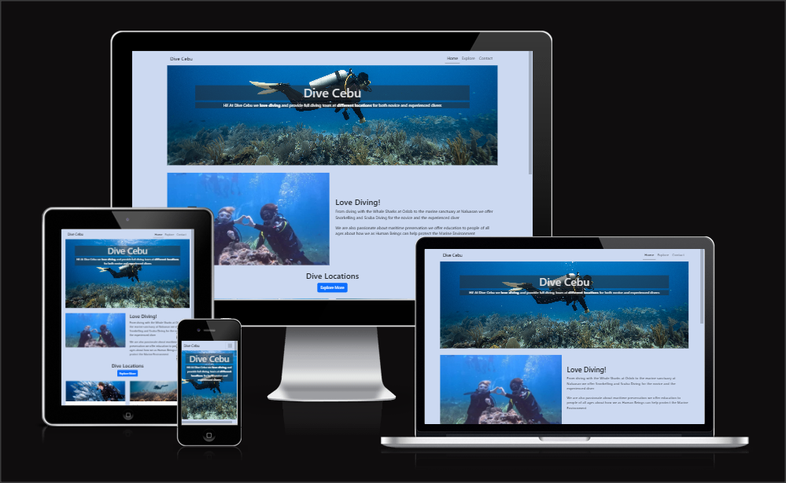
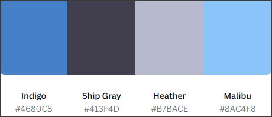
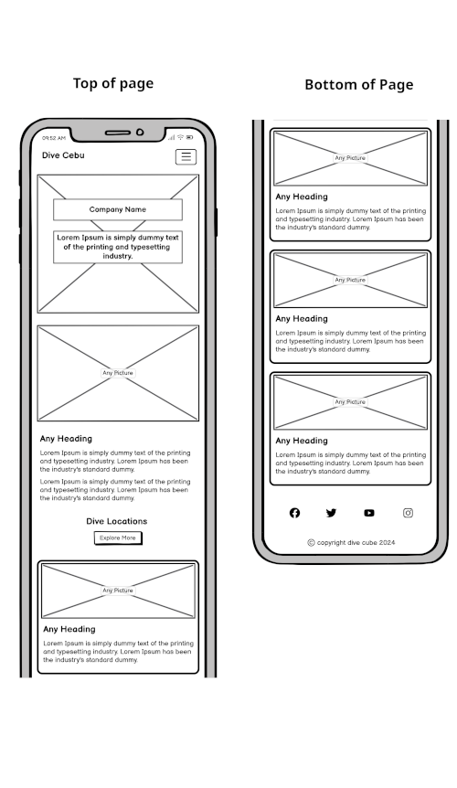
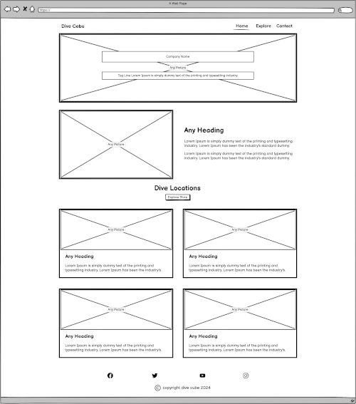
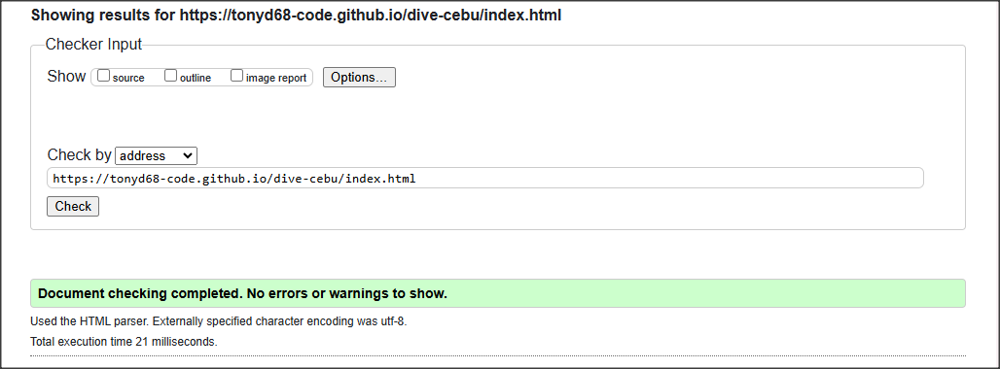
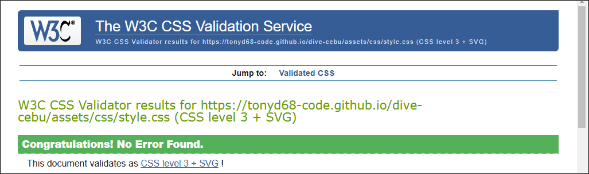
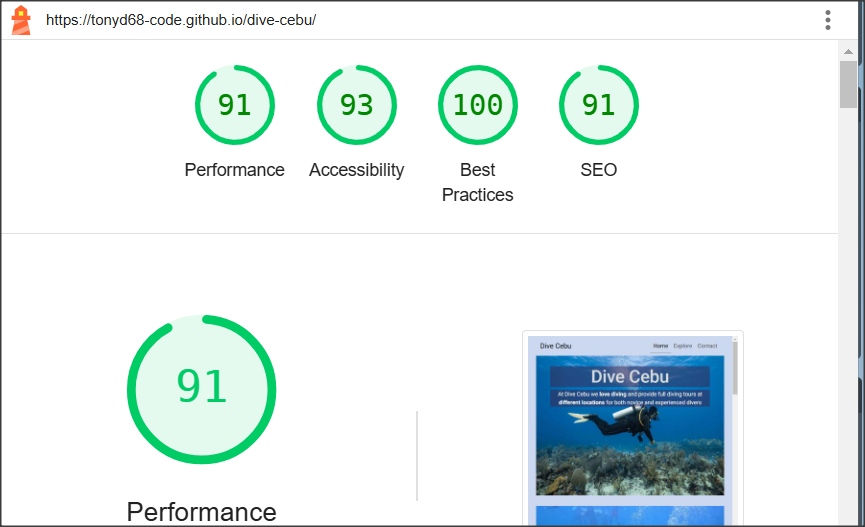

 

# Dive Cebu - Philippino Diving Website 

 This responsive site is designed for people interested in scuba diving in the Philippines and it can be viewed on various devices.

[View Dive Cebu on Github Pages](https://github.com/TonyD68-code/dive-cebu)

## About the site
* It features a simple homepage with a navbar that includes a button to go straight to a “explore” page and a contact us form. 
* The homepage offers a brief introduction and links to the explore page via cards that show a few details of each of thedive sites.
* The explore page shows 360 photo, video and various photos of dive sites.
* The 360 photo is interactive and the video has controls available to the user.
* There is a contact page to submit questions or enquiries. 
* The aim is to get the user to contact us for more information about the various types of diving offered.
* There should be assurance that users will interact with the page in some way be it through the form or viewing the 360 photo and watching the video.

## Website Goals

### Business Goals
* Ease of use and easy to navigate with good images.
* An easy contact process for anyone to use to contact the site.
* Interesting enough to click through all the webpages.
* Promote diving in the Philippines.  

### User Goals
* Find information about diving in the Philippines
* To be able to browse photos and videos
* To easily contact the site   

## User Experience

### Potential Customers
* All ages interested in Scuba Diving
* Users should find the website easy to use and navigate

## User Stories

### New User

* I want to know the subject of the site
* I want to be able to navigate the site easily
* I want to see good quality photos
* I should be able to ask questions via a contact form

### Returning User

* I want to come back to the site often to check for updates and new images
* I want to return to the site to check foir any new information
* I want to see the sites social media

## Design

### Colour Scheme

* Indigo: #4680C8
* Heather: #B7BACE
* Malibu: #8AC4F8
* Ship Gray: #413F4D

The colours were selected for their contrast and similarity to many dive photos

The website [Canva](https://www.canva.com/) has been used here to preview the colour scheme and how they look together as a palette.

## Font Family

The main logo of the site is “Roboto” a very clear and readable font. 

The websites fonts will be linked from [Google Fonts](https://fonts.google.com/) 

Most of the website will use some variation of this font styled in various ways, such as italic and bold.

The fallback font will be sans-serif.

## Images

All images used are Diving related. 

The images will be all consistent in style and colours to fit in with the website’s themes. 

The homepage images should be bright and inviting, and feature real-world photos of Diving

## Wireframes

The wireframing software Balsamiq Wireframes has been used to produce wireframe drawings and to preview the site’s layout.

Click to view mobile wireframe

### Mobile wireframe

Click to view Desktop wireframe

### Desktop wireframe

## Features

### Common features on all pages

* The site will have a responsive navigation bar at the top of the page, which disappears when scrolling down the page. 
* The navigation bar has links for Home, Explore, Contact us. 
* The links are then compacted for mobile devices as a drop-down menu. 
* The page you are currently on will be underlined. All the themes of the pages will be consistent, such as colour and font theme. 
* Clicking the main logo will always bring you back to the homepage.
* The footer will contain social media links for facebook, twitter, Instagram and Youtube.

### Home Page

The main page is a hero image with a brief text explaining what the site is. 
The links on the navigation bar are big enough that they can be noticed easily by those with visual impairments. 
The homepage establishes the feel of the site and should be very easy to navigate. 
The page will also feature an 'Explore' button above the 4 cards to allow easy user navigation to view the video and photos

### Explore

This page will feature the following;
* 360 photo
* Video
* Photos 

All of which allow the user to get a feel of what it is possible to see at various dive sites

### Contact
This page will feature a simple contact form allowing the user to make an enquiry  or ask further questions  

# Testing

## Testing User Stories

### New User

* I want to know the subject of the site
* I want to be able to navigate the site easily
* I want to see good quality photos
* I should be able to ask questions via a contact form

* Subject is clearly shown by hero image and text and description on top of hero image
* Navigation is simple with menu located on top right of every page
* good quality underwater images used througout the site

* Contact form is easily accessable via the contact link in the menu

### Returning User

* I want to come back to the site often to check for updates and new images
* I want to return to the site to check for any new information
* I want to see the sites social media

* New photos and videos will be published on explore.html on a regular basis
* News and other updates will be added to the future blog page

* social media is accessible through the links in footer on every page

## All pages were tested using W3C for validation and Google Lighthouse for performance and accessibility

index.html validation

### index.html Validation by W3C

explore.html validation

### explore.html Validation by W3C

contact.html validation

### contact.html Validation by W3C

style.css validation

### CSS Stylesheet Validation by W3C

Accessibility and Responsiveness Testing using Google Lighthouse

### Accessibility testing by Google Lighthouse

## Future Features

More pages, each dedicated to a specific dive site and showing photos and videos of only that site, these pages will be linked to from each separate card on the homepage.

Add blog to keep returning users up to date with any news and to enable new users to view news history.

## Languages and resources

* [HTML5](https://html.spec.whatwg.org/multipage/) - Markup language which makes up the site
* [CSS3](https://www.w3.org/TR/css-2022/) - Used for styling the site
* [Bootstrap v5.3](https://getbootstrap.com/) - Open source framework for responsiveness and mobile first frontend development
* [Fontawesome](https://fontawesome.com/) - Used for social media Icons
* [Google Fonts](https://fonts.google.com/) - Used for fonts
* [Momento360](https://www.momento360.com/) - Hosting of 360 images
* [Balsamiq Wireframes](https://balsamiq.com/wireframes/) – Software used to wireframe and prototype the site’s look and layout.
* [Github](https://github.com/) – Repository for the site’s code.
* [Code Institute Workspaces](https://codeinstitute-ide.net/workspaces) – IDE used to write the site.

## Testing resources

* Testing for HTML validation [W3C](https://validator.w3.org/)
* Testing for CSS valisdation [W3C CSS](https://jigsaw.w3.org/css-validator/)

## Deployment

The site was deployed to GitHub Pages. The steps to deploy are as follows:
1. In the GitHub repository, navigate to the Settings tab
2. From the source section drop-down menu, select the Main Branch, then click "Save".
3. The page will be automatically refreshed with a detailed ribbon display to indicate the successful deployment.

The live link can be found [here](https://tonyd68-code.github.io/dive-cebu/)

## Credits

### Media

* 360 photo and some others were photographed myself
* Video by good friend and Dive Buddy Mark Layton
* Other photos My good friend and wonderful divemaster Fernando Amistad
* High quality Hero images from [Envato](https://elements.envato.com/)

### Acknowledgements

* I would like to thank my Code Institute mentor, Sheryl Goldberg for her support throughout the development of this project.
* I would like to thank the Code Institute tutor team, especially Rachel Furlong for their assistance.
* I would like to thank the Code Institute Slack community for the moral support; it was invaluable at times when I could not see a light at the end of the tunnel!